
# **JOSM untuk Perhitungan Kualitas Data**

**Tujuan Pembelajaran:**

*   Memahami cara memilih dan menghitung jumlah objek dalam suatu batas administrasi
*   Mengetahui cara menghitung jumlah _error_ dan _warning_ dalam suatu batas administrasi
*   Mengetahui cara melakukan validasi batas-batas administrasi

Dalam melakukan kegiatan pemetaan salah satu targetnya adalah menghasilkan peta yang berkualitas. Salah satu kualitas yang dimaksud berupa kelengkapan jumlah data dan informasi yang diperoleh dalam kegiatan pengumpulan data di lapangan. Pemanfaatan _OpenStreetMap_ sebagai peta dasar yang digunakan untuk menampilkan hasil pengumpulan data di lapangan dapat membantu Anda dalam melakukan perhitungan baik dari banyaknya data objek yang ada kumpulkan dan juga informasi yang terdapat di dalamnya. Pada modul ini Anda akan mempelajari menghitung jumlah data infrastruktur dan batas-batas administrasi hasil pengumpulan di lapangan dengan menggunakan perangkat lunak _Java OpenStreetMap_ (JOSM) 

### **I. Menghitung Objek Dalam Batas Administrasi**

Salah satu kegiatan pada tahap memantau kualitas data adalah dengan menghitung jumlah objek yang berada di wilayah pemetaan. Tujuannya adalah untuk mengetahui pertambahan data yang ada di wilayah pemetaan sebelum dan sesudah kegiatan pemetaan dilaksanakan. Selain itu, kegiatan ini bertujuan untuk memantau kelengkapan atribut dan bentuk masing-masing objek yang menjadi prioritas di wilayah tersebut. Anda dapat menggunakan JOSM dalam melakukan perhitungan objek dalam area pemetaan.  Terdapat beberapa langkah untuk menghitung objek dalam suatu wilayah administrasi misalnya pada tingkat kelurahan.

**a. _Download_ Data OpenStreetMap di Wilayah Pemetaan**

Sebelum Anda memulai menghitung jumlah objek, tentu saja Anda harus men-_download_ data _OpenStreetMap_ di area pemetaan. Dalam melakukan perhitungan objek, Anda dapat menggunakan batas administrasi kelurahan yang terdapat di dalam wilayah kecamatan . Sebagai contoh, Anda akan menghitung jumlah objek di **Kelurahan Pleburan, Kecamatan Semarang Selatan**. Berikut adalah langkah-langkah yang dilakukan saat men-_download_ data _OpenStreetMap_:

*   Buka **JOSM** di laptop/komputer Anda.
*   Kemudian pilih menu **_File → Download Data_** ,nda akan melihat kotak area yang dapat Anda _download_ di _OpenStreetMap._
*   Pilih menu **_Areas around Places_** kemudian masukkan nama kecamatan “**Pleburan**” di kotak pencarian dan pastikan Anda telah mencentang tipe data **_OpenStreetMap Data_** dan pilihan **_Download as New Layer_.**
*   Setelah berhasil, pilih hasil pencarian yang paling sesuai dengan kecamatan yang ingin Anda _download_. Pilihlah yang berada di Semarang dan memiliki tipe _boundary=administrative_. Hasil pencarian yang anda pilih akan berwarna biru.

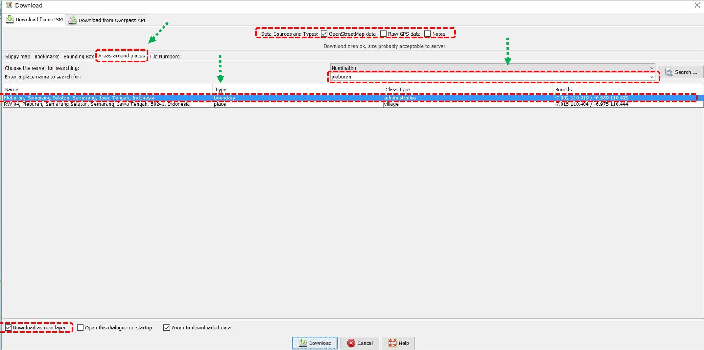

<i>Kotak pencarian area download di JOSM</i>

*   Setelah semua selesai diatur, kemudian klik **_Download._**

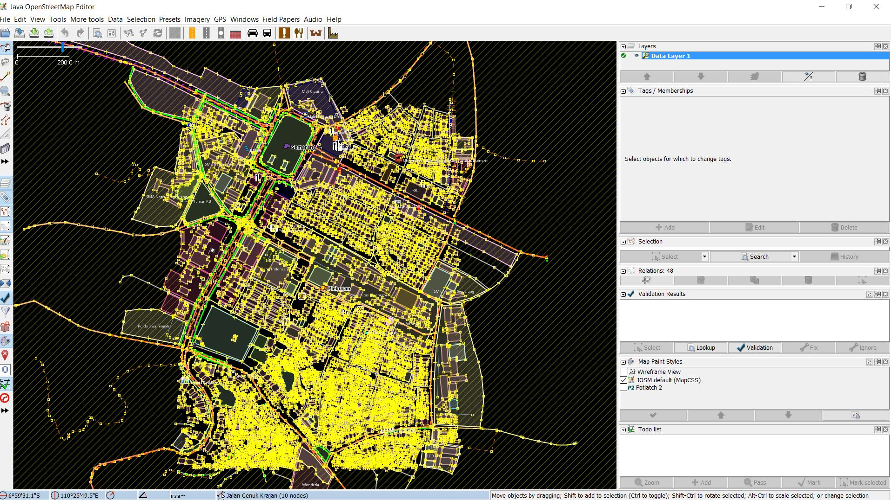

<i>Hasil  download data di JOSM</i>

>Catatan :
Jika wilayah kecamatan Anda terlalu besar, silakan download secara bertahap sampai semua area berhasil di-download ke dalam JOSM

**b. Menghitung Jumlah Objek di Suatu Wilayah Administrasi**

Jika Anda telah berhasil mendownload data di area pemetaan , maka langkah berikutnya adalah melakukan perhitungan jumlah objek di kelurahan yang telah ditentukan. Berikut adalah langkah-langkah dalam melakukan perhitungan jumlah objek:

*   Pilih **_Edit → Search_** untuk memilih batas area administrasi **Kelurahan Pleburan**.

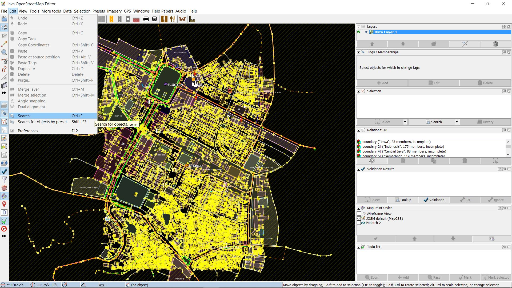

<i>Menu pencarian data di JOSM</i>

*   Kemudian di kotak pencarian silahkan ketik “**admin_level=7**” kemudian klik **_Start Search_**

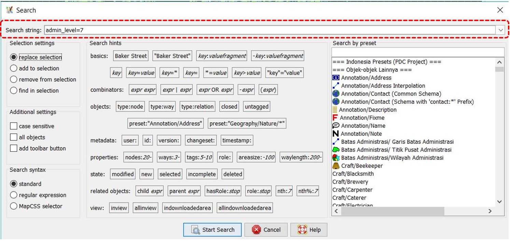

<i>Jendela pencarian untuk memilih kelurahan di JOSM</i>

*   Anda akan melihat semua obyek OSM yang memiliki _tag “admin_level=7_” akan terpilih di jendela **_selection_**.  Setelah itu silakan pilih Kelurahan Pleburan yang akan Anda hitung objek yang ada di dalam wilayah tersebut dan **klik 2 kali**. Anda akan melihat garis batas administrasi Kelurahan Pleburan akan berubah menjadi warna ungu di dalam layer data JOSM, hal ini menandakan kelurahan tersebut sudah terpilih. 

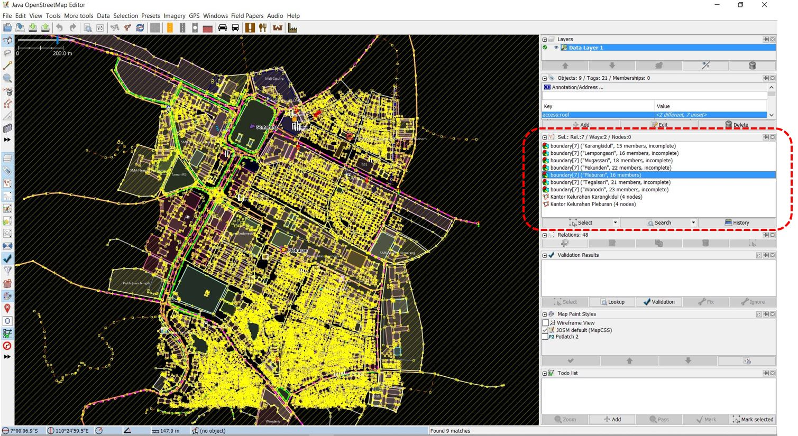

<i>Hasil pencarian kelurahan di JOSM</i>

*   Jika di JOSM Anda belum terdapat menu _Selection_ maka Anda harus menginstal _plugin utilsplugin_ di JOSM. Penjelasan tentang cara menginstal _plugin_ ini dapat Anda lihat di Modul **Menambahkan Data OSM menggunakan JOSM**. Setelah itu pilih menu **Selection → All inside [testing]**. Anda akan melihat seluruh data yang berada di Kelurahan Pleburan akan terpilih dan berwarna merah. 

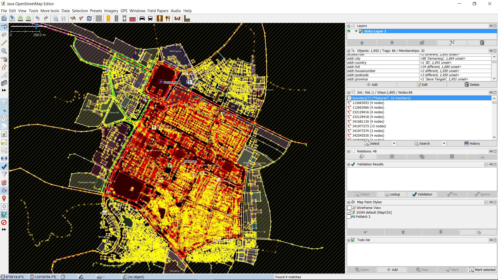

<i>Hasil seleksi data di JOSM</i>

*   Kemudian pilih kembali menu **_Selection → Intersecting Ways_** untuk memilih kembali semua data yang di dalam maupun yang bersinggungan dengan Kelurahan Pleburan, seperti jaringan jalan dan sungai. Durasi dari proses ini berlangsung tergantung dari luas wilayah dan banyaknya data yang ada di dalamnya.

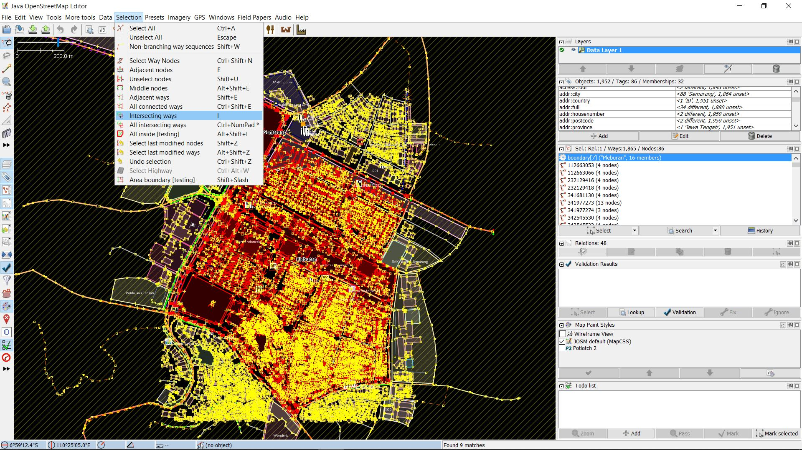

<i>Seleksi keseluruhan data di area tertentu di JOSM</i>

*   Setelah selesai Anda dapat melihat total jumlah objek di jendela **_properties/membership_** pada JOSM Anda.

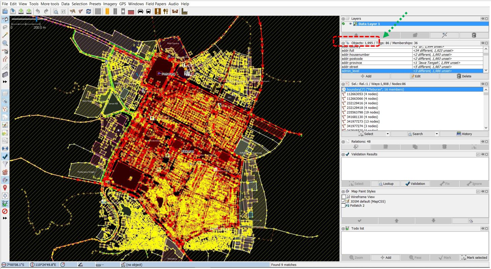

<i>Seleksi keseluruhan data di area tertentu di JOSM</i>

*   Seperti yang terlihat di Kelurahan Pleburan, total data yang ada di wilayah tersebut sebesar 1995 objek. Namun perlu Anda ingat, ini hanyalah total data **keseluruhan** di _OpenStreetMap_ yang menjadi rangkaian untuk menghitung kualitas data di JOSM, Anda tidak akan melakukan perhitungan untuk masing-masing spesifik objek. 

### **II.  Menghitung Jumlah _Error_ dan _Warning_ Dalam Batas Administrasi**

Setelah berhasil menghitung total data dalam area pemetaan atau dalam contoh ini adalah Kelurahan Pleburan, Anda akan melanjutkan langkah-langkah untuk menghitung jumlah _Error_ dan _Warning_ dalam data yang telah Anda pilih di Kelurahan Pleburan. Berikut adalah langkah-langkah yang dapat dilakukan:

*   Klik tombol **_Validation_** pada jendela validasi di JOSM. Kemudian tunggu hingga JOSM selesai menghitung jumlah _Error_ dan _Warning_ yang ada di data Anda.

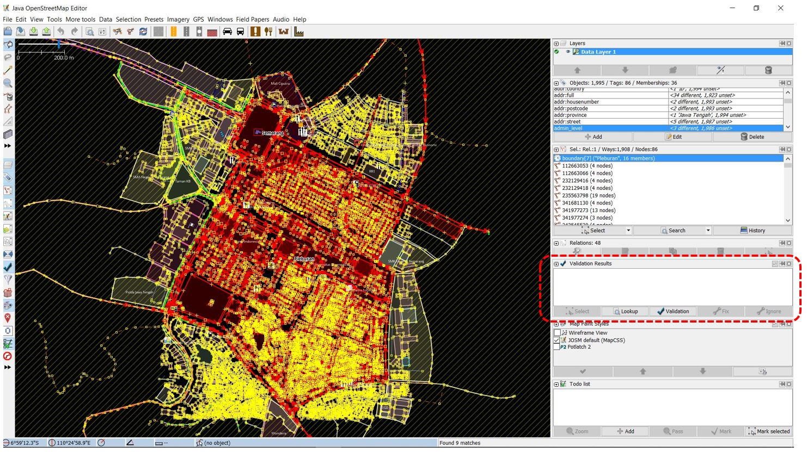

<i>Jendela validasi data di JOSM</i>

*   Jika JOSM sudah selesai menghitung, maka akan muncul daftar _error_ dan _warning_ pada data tersebut. Anda sebaiknya mencatat jumlah _error_ dan _warning_ yang terdapat pada jendela validasi serta langsung memperbaiki dan menyelesaikan semua warning dan error.  Untuk penjelasan lebih lanjut tentang cara memperbaiki (validasi) data di JOSM serta daftar _error_ dan _warning_ yang sering terjadi dapat anda lihat pada Modul **Penggunaan JOSM untuk Validasi Data Survei**.

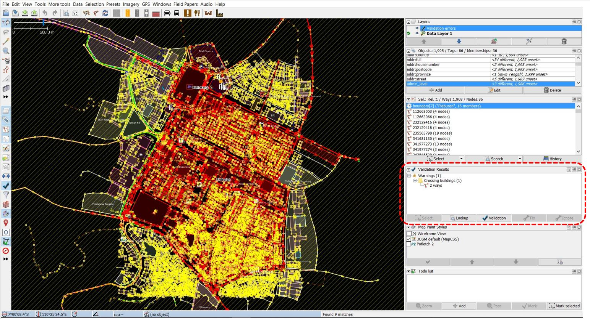

<i>Hasil validasi data di JOSM</i>

*   Setelah memperbaiki _error_  dan _warning_ yang ada, Anda dapat melakukan rekapitulasi perhitungan kualitas data di **Microsoft Excel atau Google Sheet**. Hal ini bertujuan untuk melihat perbandingan kualitas data yang ada di kelurahan pemetaan, sebelum dan sesudah kegiatan pengumpulan data di lapangan, sehingga Anda dapat melihat progres dari kegiatan pemetaan tidak hanya dari sisi kuantitas tapi juga dari kualitas data yang dihasilkan. Jenis _error_ dan _Warning_ yang dihasilkan juga dimasukkan ke dalam tabel perhitungan.

Tabel Rekapitulasi Perhitungan Kualitas Data

Seperti yang dapat Anda lihat pada tabel di atas, jumlah objek di Kelurahan Pleburan sebelum pemetaan adalah 1.863 dimana terdapat 4 _warning_ pada data yang ada. Kemudian setelah dilakukan kegiatan pengumpulan data di lapangan dan validasi data jumlah data yang ada di kelurahan tersebut meningkat menjadi 1.963 dimana tidak terdapat _error_ maupun _warning_ sama sekali.  Anda dapat melihat contoh tabel hasil perhitungan kualitas data di Kota Semarang secara keseluruhan di [http://bit.ly/tabeldatasemarang](http://bit.ly/tabeldatasemarang) 

**III. Melakukan Validasi Batas-Batas Administrasi**

Setelah Anda melakukan rekapitulasi atau perhitungan jumlah objek dan kualitas data OSM di kelurahan pemetaan, hal yang tidak kalah penting untuk dilakukan adalah melakukan perhitungan untuk kualitas data terhadap batas-batas administrasi. Dalam perhitungan ini, Anda akan melakukan validasi terhadap batas-batas kelurahan dan rukun warga (RW) yang terdapat di kelurahan tersebut. Adapun validasi yang dilakukan adalah meliputi jumlah RW yang dipetakan, kelengkapan informasi (_tag_), relasi dari batas kelurahan dan RW, dan melakukan _backup_ batas administrasi dengan menyimpannya sebagai file _.osm_ yang baru. Kita kembali akan menggunakan **Kelurahan Pleburan** yang telah kita _download_ pada materi sebelumnya.

**a. Menghitung Jumlah RW**

Berikut adalah langkah-langkah yang harus Anda lakukan dalam menghitung jumlah RW:

*   Anda telah memiliki data _OpenStreetMap_ Kelurahan Pleburan. Namun, data yang Anda miliki adalah data keseluruhan dimana memiliki berbagai macam objek di dalamnya sehingga bisa menyulitkan Anda untuk melihat batas-batas administrasi di wilayah tersebut. Untuk itu, Anda dapat melakukan _filter_ data di JOSM. Jika Anda belum mengetahui fungsi alat _filter_ dan cara penggunaanya dengan lebih lanjut silahkan melihat Modul **Menggunakan Alat Filter di JOSM**.
*   Aktifkan alat _filter_ di JOSM dengan cara klik menu **_Windows → Filter_**

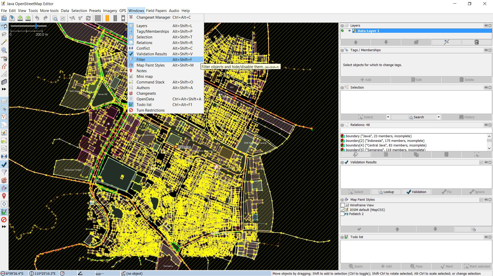

<i>Langkah untuk melakukan filter data OpenStreetMap di JOSM</i>

*   Jendela **_filter_** akan muncul di JOSM Anda. Kemudian silakan klik **_add_** dan masukkan **_query_** untuk menyaring data sehingga yang akan ditampilkan di JOSM hanya batas-batas administrasi saja. _Query_ tersebut adalah “**is_in:village”=”Pleburan**”. 
*   Anda akan melihat tampilan data di JOSM anda akan berubah seperti berikut:

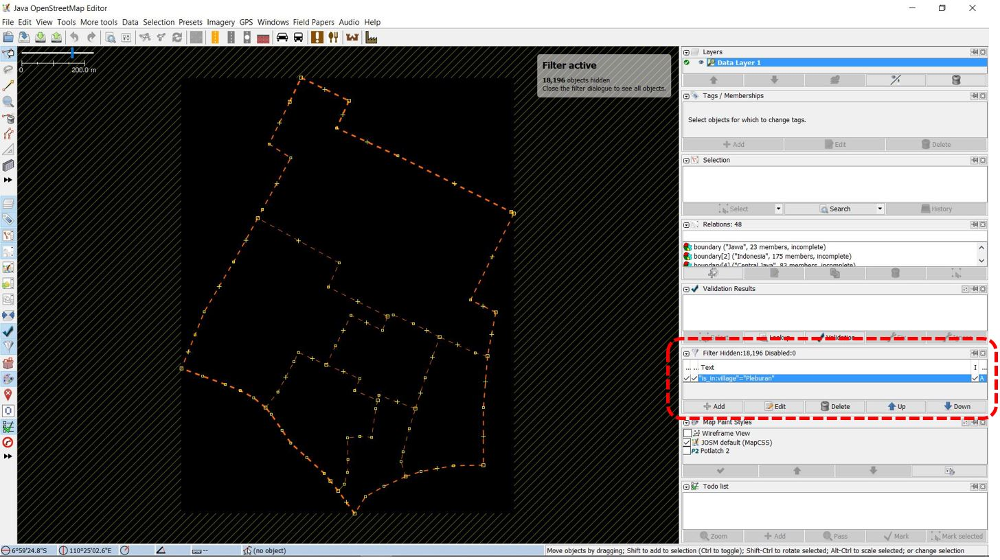

<i>Tampilan hasil filter data untuk batas-batas administrasi di JOSM</i>

*   Kemudian pilih seluruh batas RW yang ada di Kelurahan Pleburan dengan cara menggunakan alat _search_. Klik menu **_Edit → Search_**. Anda kemudian akan melihat jendela pencarian. Kemudian masukkan _query_ “**admin_level=9**” dan klik **_Start Search_**.

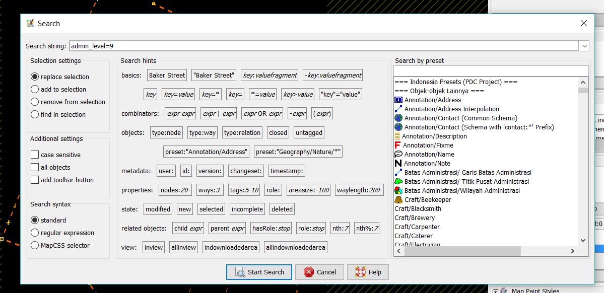

<i>Query untuk pencarian batas-batas RW di JOSM</i>

*   Anda akan melihat batas RW di data yang terpilih. Hal ini ditunjukkan dengan garis-garis batas administrasi menjadi warna ungu. Kemudian di bagian jendela ***selection*** Anda akan melihat daftar RW yang ada di data Kelurahan Pleburan.

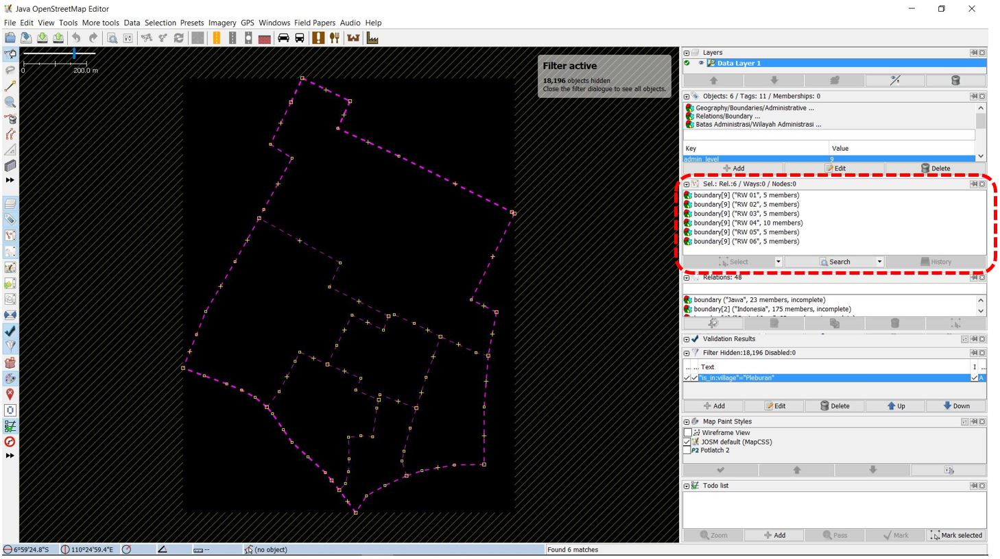

<i>Hasil seleksi untuk batas-batas RW di Kelurahan Pleburan</i>

*   Anda dapat membandingkan jumlah RW yang ada di Kelurahan Pleburan yang merupakan hasil _selection_ di JOSM dengan tabel rekapitulasi hasil pengumpulan data di lapangan. 

  

<i>Contoh tabel rekapitulasi jumlah RW di kelurahan pemetaan</i>

Anda dapat melihat pada tabel di atas bahwa jumlah RW yang ada di Kelurahan Pleburan sebanyak 6 RW dan pada gambar hasil seleksi batas RW di JOSM juga terlihat terdapat 6 RW yang terpilih mulai dari RW 01 hingga RW 06. Dengan begitu telah terdapat kesamaan data dan Anda dapat memvalidasi jumlah RW di Kelurahan Pleburan yang ada di _OpenStreetMap_. 

**b. Menghitung Kelengkapan _Tag_ dan Relasi Batas-Batas Administrasi**

Setelah menghitung jumlah RW di Kelurahan Pleburan, sekarang Anda perlu untuk menghitung kelengkapan informasi (_tag_) yang harus dimiliki oleh batas RW tersebut. Berikut adalah informasi (_tag_) untuk batas-batas administrasi RW:

Tabel _Tag_ Batas Administrasi Rukun Warga (RW)

| key  |  possible values |
|---|---|
|  type | boundary  |
|  boundary |  administrative |
|  name | (nama RW)  |
|  admin_level | 9 |
|  is_in:province |  (nama provinsi) |
|  is_in:city (Kota) / is_in:town (Kabupaten)| (nama kota/kabupaten)   |
|  is_in:municipality | (nama kecamatan)   |
|  is_in:village | (nama kelurahan)   |
|  is_in:RW | (nama rw)  |
|  flood_prone *khusus untuk relasi RW |  yes (Iya), no (Tidak) |
|  landslide_prone *khusus untuk relasi RW   |  yes (Iya), no (Tidak) |
|  source |  HOT_InAWARESurvey_2018 **(Disesuaikan dengan kegiatan pemetaan)**|
 
Untuk melakukan validasi _tag _batas-batas RW, Anda dapat mengikuti langkah-langkah sebagai berikut:

*   Pilih semua daftar RW pada jendela **_selection_** hasil dari fitur **_search_** di JOSM.

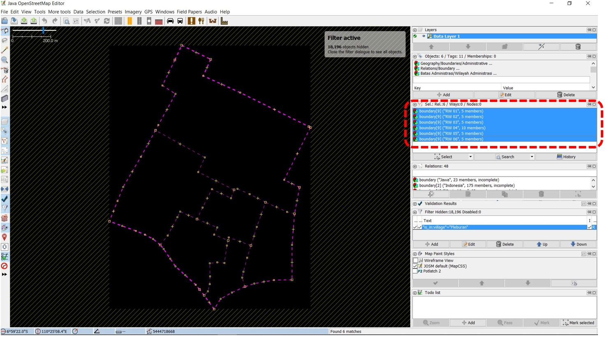

<i>Memilih daftar RW yang ada di Kelurahan Pleburan</i>

*   **klik kanan** pada daftar RW kemudian pilih **Edit**. Anda kemudian akan melihat kotak peringatan bahwa Anda akan membuka seluruh informasi untuk masing-masing batas RW dimana untuk Kelurahan Pleburan akan terbuka sebanyak 6 jendela informasi. Silahkan klik **Ok.**

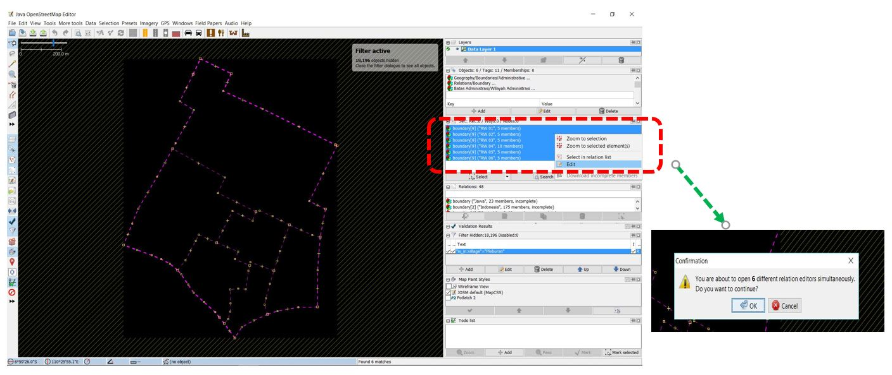

<i>Langkah melihat informasi batas-batas RW</i>

*   Setelah jendela terbuka silahkan Anda periksa kelengkapan informasi (_tag_) untuk **masing-masing** batas RW. Selain itu, periksa hubungan relasi dengan antar batas-batas RW lain dengan melihat alur relasi di bagian **_member_**. Relasi yang baik adalah jika hubungan antara member batas RW saling terhubung dan membentuk _loop_ atau lingkaran yang terhubung. Jika Anda ingin mengetahui hubungan antar relasi dan cara melakukan input batas-batas administrasi di JOSM dengan lebih lengkap, maka Anda dapat melihat Modul **Membuat Batas Administrasi di JOSM**.

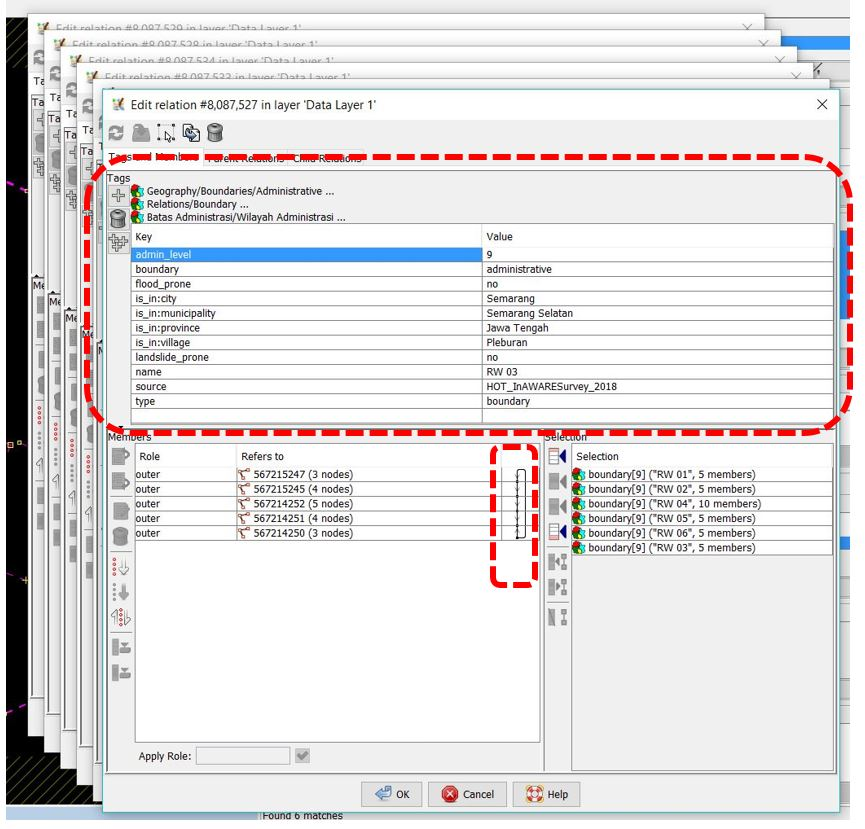

<i>Kotak relasi dan informasi batas administrasi di JOSM</i>

Anda dapat menambahkan _tag_ jika di RW tersebut belum sesuai dengan model data yang telah ditentukan dan memperbaiki bentuk relasi dengan mengatur urutan member dan _rules_ masing-masing _member_.

> Catatan :
Jika terdapat kekurangan atau kelebihan jumlah RW, maka Anda perlu mendiskusikan masalah ini dengan Data Entry yang melakukan pengumpulan data dan Quality Assurance yang melakukan input batas-batas administrasi ke dalam OpenStreetMap.
Lakukan langkah-langkah pengecekan yang sama terhadap relasi batas administrasi kelurahan ("admin_level=7") dan kecamatan ("admin_level=6")

**c. Melakukan _Backup_ Batas Administrasi**

Setelah melakukan perhitungan dan validasi untuk batas-batas administrasi, Anda perlu untuk melakukan _backup_ batas administrasi. Hal ini dilakukan agar Anda dapat memiliki cadangan batas administrasi wilayah pemetaan jika terjadi sesuatu yang tidak diinginkan seperti batas administrasi tersebut hilang atau ada pengguna lain yang mengubahnya secara tidak tepat. Untuk melakukan hal tersebut Anda dapat mengikuti langkah-langkah berikut ini:

*   Silahkan klik menu **_Edit → Copy_**

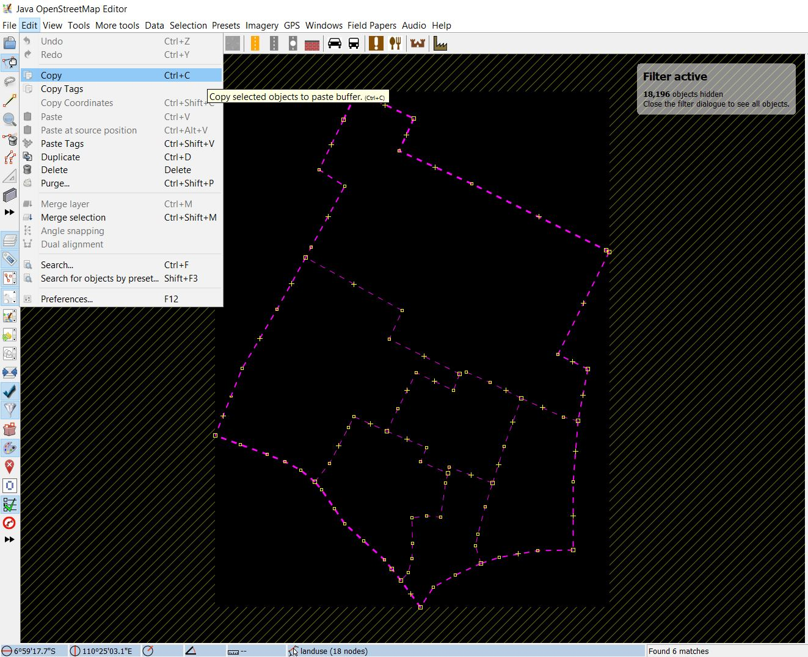

<i>Menyalin data batas administrasi di JOSM</i>

*  Kemudian pilih **_File → New Layer_**. Anda akan melihat _layer_ baru pada _JOSM_.

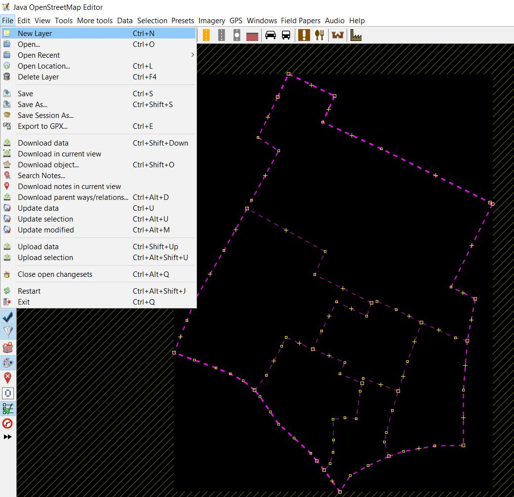

<i>Membuat layer baru pada JOSM</i>

*   Kemudian klik **_Edit → Paste at source position_**

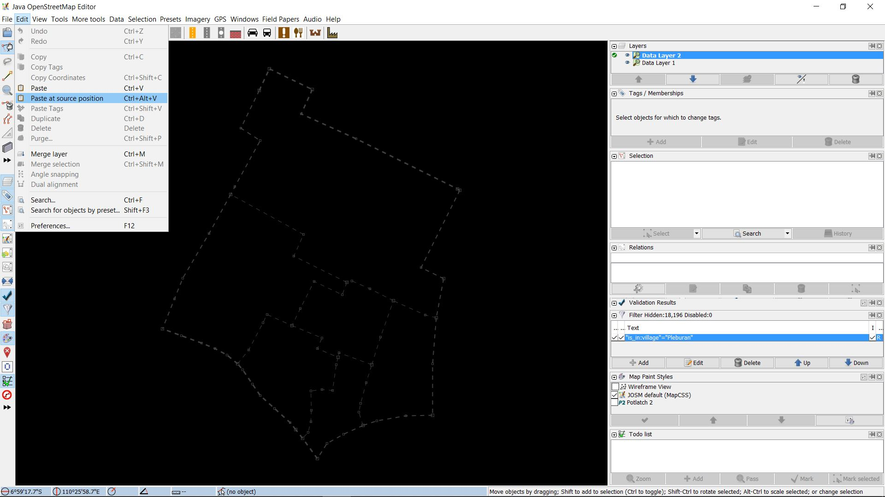

<i>Menyalin batas administrasi pada Layer baru pada JOSM</i>

*   Anda akan memiliki _layer_ baru yang hanya berupa data batas-batas administrasi saja. Kemudian klik menu **File → Save** dan simpan data tersebut ke dalam format _file .osm_ dan berikan nama sesuai dengan kelurahan yang Anda petakan.

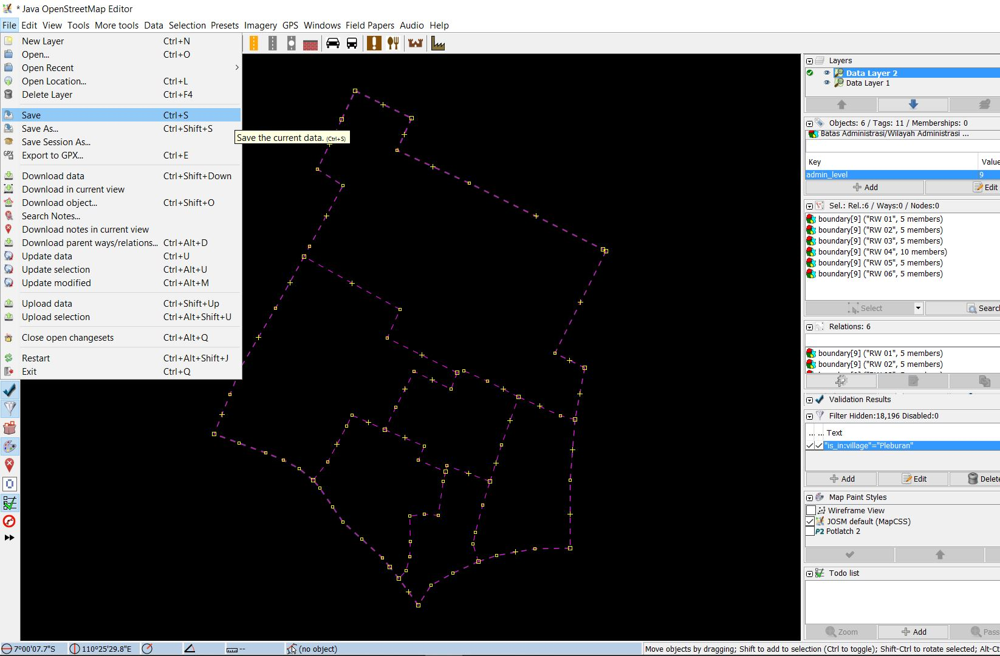

<i>Menyimpan layer batas administrasi di JOSM</i>

**RINGKASAN**

Anda telah mempelajari cara untuk melakukan perhitungan kualitas data di JOSM. Materi ini merupakan salah satu dari kegiatan rekapitulasi sekaligus validasi dari data yang telah dimasukkan ke dalam _OpenStreetMap_ setelah melakukan pengumpulan data di lapangan oleh _Data Entry_ dan telah divalidasi oleh _Quality Assurance_. Dengan melakukan perhitungan kualitas data yang telah divalidasi oleh Quality Assurance, akan menghasilkan kualitas data yang semakin baik.  Berikut adalah beberapa hal yang telah Anda pelajari dalam modul ini:

*   Menghitung jumlah objek dalam batas administrasi kelurahan tertentu
*   Menghitung _error_ dan _warning_ dalam batas administrasi kelurahan tertentu
*   Melakukan rekapitulasi perbandingan jumlah data dan jumlah _error_ / _warning_
*   Melakukan validasi batas administrasi meliputi menghitung jumlah RW, mengecek kelengkapan informasi (_tag_) dan relasi antara batas-batas administrasi
*   Melakukan backup data administrasi dalam file .osm

