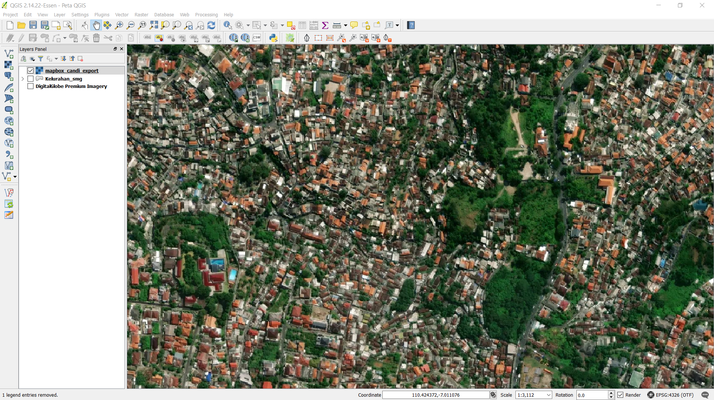
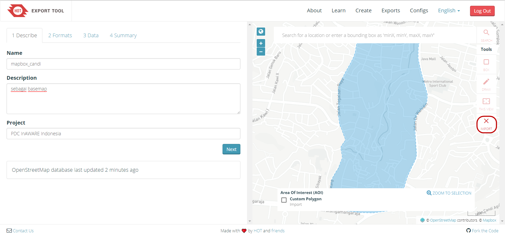
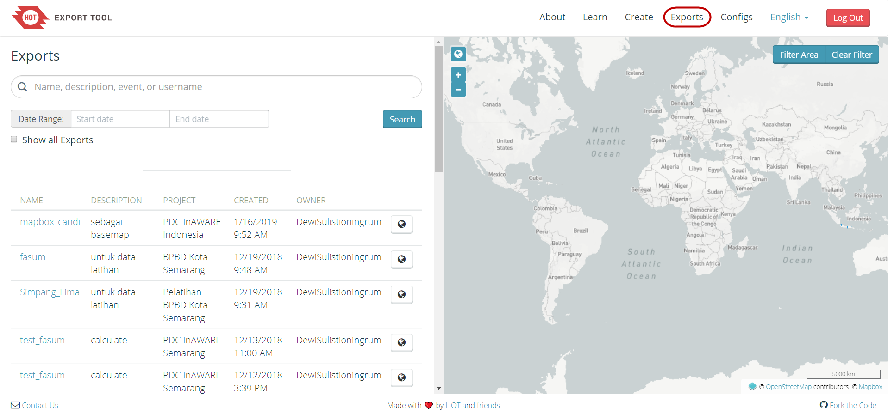
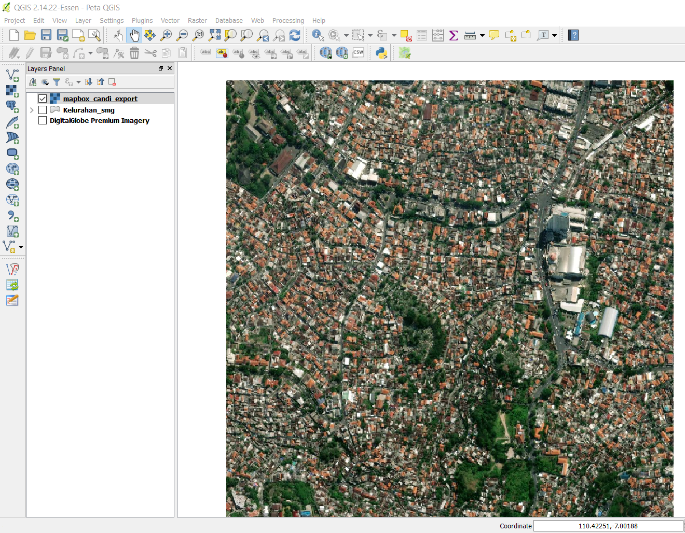
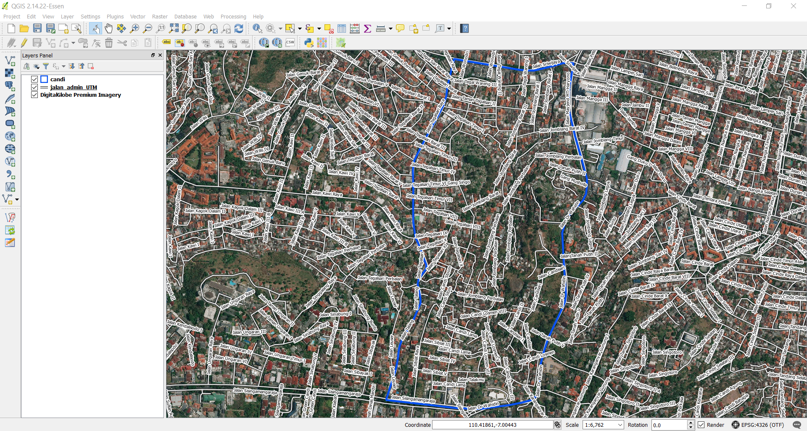
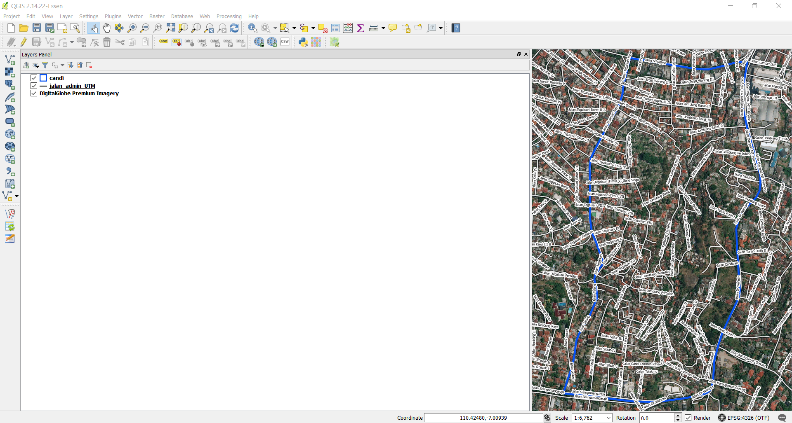
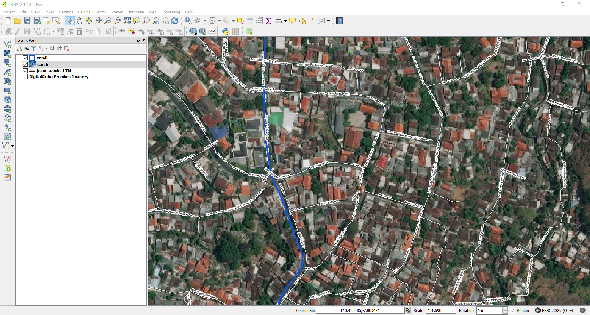

# **Pembuatan MBTiles untuk OpenMapKit (OMK)**

**Tujuan Pembelajaran:**

*   Memahami konsep MBTiles
*   Mengoperasikan cara membuat MBTiles dengan menggunakan _Export Tool_
*   Mengoperasikan cara membuat MBTiles dengan menggunakan _Plugin_ QTiles
*   Memahami cara memindahkan _file_ MBTiles ke dalam OMK pada _smartphone_

Pada saat Anda menggunakan aplikasi _OpenMapKit_ (OMK) untuk melakukan survei lapangan, terkadang Anda akan mengalami kesulitan dalam menentukan objek di aplikasi tersebut. Hal ini dikarenakan, latar belakang peta yang digunakan belum dipetakan di dalam _OpenStreetMap_ dan Anda tidak memiliki waktu untuk mendigitasi objek di wilayah survei. Anda dapat menggunakan MBTiles untuk latar belakang peta yang merupakan citra satelit, sehingga memudahkan Anda dalam melakukan identifikasi objek di lapangan.

### **I. Pengertian MBTiles**

MBTiles merupakan format data spasial untuk menyimpan beberapa _tile_ peta yang digabung menjadi satu _file_ dalam bentuk raster, sehingga tampilannya seperti citra satelit. Salah satu penggunaan MBTiles yaitu dapat digunakan sebagai _basemap_ di dalam aplikasi OMK, yang memudahkan pengguna untuk menandai sebuah objek di lapangan. _Basemap_ merupakan sebuah peta dasar yang menjadi latar belakang sebuah aplikasi, dapat berupa citra satelit dan peta OSM.

<i>Tampilan MBTiles pada QGIS</i>

**II. Membuat MBTiles dengan _Export Tool_**

_Export Tool_ merupakan salah satu situs yang digunakan untuk men-_download_ data _OpenStreetMap_ secara gratis berdasarkan fitur dan wilayah tertentu. Dimana format data spasial yang sering digunakan, yaitu: _Shapefile (.shp), GeoPackage (.gpkg), dan MBTiles (.mbtiles)_. Langkah-langkah untuk membuat MBTiles dengan menggunakan _export tools_ yaitu :

*   Buka halaman situs Anda dan ketikkan [https://export.hotosm.org/en/v3/](https://export.hotosm.org/en/v3/), Anda harus **_login_** terlebih dahulu dengan menggunakan akun _OpenStreetMap_. Jika belum memiliki akun, Anda dapat membuatnya di situs [https://www.openstreetmap.org](https://www.openstreetmap.org) pada modul **Memulai Menggunakan OSM**. 
*   Setelah Anda berhasil masuk, klik **_Start Exporting_**

  

<i>Tampilan Export Tool</i>

*   Lengkapi kotak dialog di sebelah kiri sebagai deskripsi proyek dan pilih wilayah yang Anda inginkan. Pemilihan wilayah dapat dilakukan dengan beberapa pilihan dengan _tools_ yang berada di panel sebelah kanan. Anda tidak disarankan untuk memilih area yang terlalu besar pada penentuan luasan wilayah pembuatan MBTiles, karena akan terjadi kegagalan saat proses berlangsung. Jika Anda memiliki batas administrasi dalam format *.geojson* dapat menggunakan pilihan _**Import**_. Hal yang perlu diperhatikan _file_ *.geojson* harus terdiri dari satu jenis data atribut. Pada modul ini, fitur yang akan digunakan adalah _Import_. Pilih ***Import*** dan masukkan _file_ *.geojson* yang Anda miliki. Jika Anda tidak memiliki _file .geojson_, maka Anda dapat membuka modul **Menggunakan GeoJSON**. 

<i>Pengaturan Menu Describe</i>

*   Langkah selanjutnya, klik **Menu Format → Beri tanda centang pada MBTiles**

  

<i>Pemilihan format data spasial</i>

*   Selanjutnya klik pada bagian **Menu Data**, Anda harus menyalin alamat URL _tilemap_ dari citra satelit yang akan digunakan sebagai _basemap_. Anda mungkin hanya bisa melihat OpenStreetMap sebagai salah satu opsi untuk membuat MBTiles. Secara pengaturan awal _Export Tools_ hanya menyediakan OpenStreetMap sebagai latar belakang MBTiles Anda. Namun, Anda bisa dengan mudah menambahkan tautan citra satelit lain. Untuk menambahkan tautan di bawah, pilih salah satu citra satelit yang tersedia, **salin (_copy_)** tautan di bawah dan **letakkan (_paste_)** pada kotak **_MBTiles Source_** yang terdapat di dalam **Menu Data**. 

        Mapbox Satellite = https://tinyurl.com/mbtiles-mapbox
        [http://a.tiles.mapbox.com/v4/openstreetmap.map-inh7ifmo/{z}/{x}/{y}.png?access_token=pk.eyJ1Ijoib3BlbnN0cmVldG1hcCIsImEiOiJncjlmd0t3In0.DmZsIeOW-3x-C5eX-wAqTw](http://a.tiles.mapbox.com/v4/openstreetmap.map-inh7ifmo/{z}/{x}/{y}.png?access_token=pk.eyJ1Ijoib3BlbnN0cmVldG1hcCIsImEiOiJncjlmd0t3In0.DmZsIeOW-3x-C5eX-wAqTw)

        Digital Globe = https://tinyurl.com/mbtiles-DG
	    [https://a.tiles.mapbox.com/v4/digitalglobe.316c9a2e/{z}/{x}/{y}.png?access_token=pk.eyJ1IjoiZGlnaXRhbGdsb2JlIiwiYSI6ImNqZGFrZ2c2dzFlMWgyd2x0ZHdmMDB6NzYifQ.9Pl3XOO82ArX94fHV289Pg](https://a.tiles.mapbox.com/v4/digitalglobe.316c9a2e/{z}/{x}/{y}.png?access_token=pk.eyJ1IjoiZGlnaXRhbGdsb2JlIiwiYSI6ImNqZGFrZ2c2dzFlMWgyd2x0ZHdmMDB6NzYifQ.9Pl3XOO82ArX94fHV289Pg)

*   Setelah Anda salin, Anda dapat menggeser ke kiri dan memilih tautan yang baru saja dimasukkan.  

  

<i>Pengaturan Sumber Tautan Citra Satelit</i>

*   Lakukan pengaturan **_Zoom Range_** yang digunakan untuk memilih batas level untuk memperbesar dan memperkecil tampilan MBTiles. Sebagai catatan, jika jarak antar _zoom range_ semakin jauh maka ukuran file akan semakin besar.

  

<i>Pengaturan Zoom Level</i>

  

<i>Kiri (zoom level 10) dan kanan (zoom level 18)</i>

*   Langkah terakhir pilih menu **_Summary_**, pada bagian ini akan ditampilkan ringkasan dari proyek yang telah Anda lakukan. Jika proyek Anda ingin terlihat oleh pengguna lainnya dapat memilih **_Publish this Export_**. Kemudian klik **_Create Export_** untuk memproses pembuatan MBTiles. 

  

<i>Menu summary</i>

*   Dalam proses pembuatan MBTiles dibutuhkan beberapa menit tergantung dengan jaringan internet, luasan wilayah, dan _zoom range_ yang telah diatur sebelumnya. Anda tidak perlu menunggu, karena _export tool_ akan memberikan pemberitahuan melalui email saat proses telah selesai. Anda juga dapat melihat proyek lain yang telah dibuat pada **_Menu Exports_**.

<i>Tampilan Menu Exports</i>

*   Setelah proses selesai, status proyek Anda berubah menjadi **_COMPLETED_**. Klik nama _file_ yang ditandai dengan warna biru untuk men-_download_ _file_ mbtiles.

  

<i>Download File MBTiles</i>

*   MBTiles dapat dibuka dengan menggunakan _software_ pemetaan seperti QGIS, sehingga menjadi tampilan citra satelit dalam bentuk _offline_. Hal ini dapat digunakan untuk memeriksa _file_ mbtiles sebelum dimasukkan ke dalam aplikasi OMK, caranya buka **QGIS _→ Add Raster Layer_**

<i>Tampilan MBTiles di dalam QGIS</i>

### **III. Membuat MBTiles dengan menggunakan _Plugin_ QTiles**

_Plugin_ QTiles merupakan _plugin_ yang dapat digunakan untuk menghasilkan _tile_ raster dari proyek QGIS. Plugin ini dapat menyimpan pengaturan perbesaran tampilan _tile_ raster dari layanan _tile_ seperti _(Slippy map_, TMS). Anda dapat menggunakan _plugin_ QuickMapServices pada modul sebelumnya **Pembuatan Peta Survei dengan QGIS**, untuk menampilkan layanan _tile_ raster. Kelebihan lainnya dengan menggunakan _plugin_ ini, Anda dapat menampilkan layer jalan dan batas administrasi pada proyek QGIS, sehingga pada tampilan _basemap_ OMK akan membantu _data entry_ dalam pengenalan survei lapangan. Langkah - langkah yang dilakukan untuk membuat mbtiles dengan _plugin_ QTiles, sebagai berikut:

**a. Instal _Plugin_ QTiles**
*   Buka QGIS dan_ install plugin_ dengan klik **_Menu Plugin → Manage and Install Plugin_.**Tuliskan pada kotak pencarian (**_Search_**) “qtiles” maka akan tampil di bawah ini, berikan tanda centang dan klik **_Install Plugin_**. Jika _download plugin_ tidak berhasil, maka Anda dapat memeriksa jaringan internet. 

  

<i>Instal Plugin QTiles</i>

*   QTiles akan muncul pada **_Menu Plugin → QTiles → QTiles_**

  

<i>Plugin QTiles</i>

**b. Persiapan Data _Layer_**

*   Tambahkan data layer administrasi dan jaringan jalan yang dihasilkan dari pemetaan survei lapang. Klik **_Add Vector Layer_**  →  arahkan ke direktori penyimpanan file **_→ Open → Open_**. Data _layer_ akan tampil pada peta kanvas dan panel _layer_. 

  

<i>Menambahkan layer</i>

 
*   Lakukan simbologi dan pemberian label pada _layer_ tersebut agar memudahkan _data entry_ dalam pengenalan survei lapangan.

  

<i>Simbologi dan pemberian label</i>

*   Sekarang Anda dapat menambahkan data _layer_ yang berbentuk _tilemap_ untuk menampilkan citra satelit pada peta kanvas QGIS, dengan cara klik **_Menu Web → QuickMapServices → Search QMS_**

  

<i>Plugin QuickMapServices</i>

*   Pada kotak pencarian **_Search QMS_** ketikkan **DigitalGlobe Premium Imagery**, kemudian klik **_Add_**

  

<i>Pemilihan basemap</i>

*   Basemap citra satelit akan muncul pada daftar _layer_ dan _map canvas_ 

<i>Tampilan citra satelit DigitalGlobe Imagery</i>

**c. Penggunaan _Plugin_ QTiles**

*   Anda dapat mengatur tampilan data _layer_, misalnya disesuaikan dengan tampilan batas administrasi, agar mempercepat proses pembuatan mbtiles

<i>Pengaturan Tampilan Batas Administrasi</i>

   
*   Untuk menampilkan _plugin_ QTiles, klik **_Menu Plugin → QTiles → QTiles_**.  Kemudian akan tampil kotak dialog QTiles, klik **_Browse_** pada **_Directory_** dan buatlah folder baru dan nama _file_ pada laptop/komputer Anda. Pada jenis _file_ ganti dengan **_mbtiles_** dan simpan. 

  

<i>Pengaturan penyimpanan file pada QTiles</i>

*   Anda dapat mengatur perbesaran pada _basemap digital globe_ dengan pengaturan yang terletak di bawah kotak dialog QTiles. Lakukan pengaturan pada **_minimum zoom_** dan **_maximum zoom_**, sebaiknya jarak antara keduanya tidak terlalu jauh, untuk mempercepat proses pembuatan mbtiles. Klik **_Run_** untuk memulai proses pembuatan mbtiles, proses ini akan memerlukan jaringan internet.

  

<i>Pengaturan pada QTiles</i>

*   Jika proses sudah 100%, maka Anda dapat klik _Close_. Untuk memeriksa _file_ mbtiles tersebut, Anda dapat memasukkan _file_ tersebut ke dalam QGIS dengan menggunakan ***Add Raster Layer***
→ arahkan ke direktori penyimpanan → _Open_. 

  

<i>Pencarian file mbtiles</i>

*   Tampilan mbtiles tersebut akan muncul pada peta kanvas QGIS, seperti gambar di bawah ini

<i>Tampilan hasil mbtiles</i>

### **IV. Memasukkan MBTiles ke dalam OMK**

Pada proses ini, Anda telah memiliki _file_ dalam bentuk format mbtiles yang akan dimasukkan ke dalam aplikasi OMK pada _smartphone android_.

*   Hubungkan perangkat _smartphone_ dengan komputer untuk memindahkan kedua _file_ tersebut ke dalam aplikasi OMK dengan kabel data.
*   Temukan aplikasi OMK di dalam direktori internal _smartphone_, arahkan ke dalam **folder mbtiles**. Folder **mbtiles** digunakan untuk menyalin _file basemap_ dalam format _.mbtiles_ yang dihasilkan dari _export tool_ atau dari _plugin_ QTiles yang terdapat di QGIS.

  

<i>Direktori OpenMapKit (OMK)</i>

 
* Buka aplikasi *OpenMapKit* pada *smartphone* Anda, dan aktifkan file *.mbtiles* yang telah dipindahkan dengan klik Menu *Basemap* pada aplikasi *OpenMapKit*.

  

<i>File .mbtiles saat di buka di OMK</i>

**RINGKASAN**

Jika Anda telah menyelesaikan bab ini, Anda dapat membuat semua _basemap_ berdasarkan wilayah administrasi yang diperlukan untuk aplikasi OMK yang akan digunakan dalam survei lapangan. Harap mengganti _file .mbtiles_ per hari berdasarkan wilayah survei di dalam _smartphone_ Anda agar tidak memberatkan kinerja _smartphone_. 
