# Konversi Data Shapefile ke GeoJSON

**Tujuan Pembelajaran:**
*   Memahami Pengertian Data GeoJSON
*   Mengetahui Melakukan Konversi _Shapefile_ ke GeoJSON dengan QGIS
*   Mengetahui Cara Mendapatkan GeoJSON dengan _Overpass Turbo_
*   Mengetahui Melakukan Konversi _Shapefile_ ke GeoJSON dengan _GeoData Converter_

Jika Anda tidak memiliki latar belakang pendidikan di bidang geografi ataupun tidak terlalu familier dengan Sistem Informasi Geografi (SIG) maka format GeoJSON ini mungkin terdengar asing bagi Anda. Akan tetapi, Anda tidak perlu khawatir dengan hal tersebut karena mendapatkan data spasial dengan format GeoJSON tidak sesulit yang Anda kira. GeoJSON dapat diperoleh dengan mengubah atau melakukan konversi dari data spasial yang sudah Anda miliki seperti _shapefile_, _keyhole markup language (.kml)_ maupun hasil GPS yaitu _.gpx_ . Dalam modul ini Anda akan mempelajari pengertian dari data GeoJSON hingga beberapa alat yang dapat membantu Anda untuk melakukan konversi data spasial khususnya _shapefile_ ke dalam format GeoJSON.

### **I. Pengertian Data GeoJSON**

GeoJSON, yang merupakan modifikasi dari _Java Script Object Notation_ (JSON), adalah sebuah format data spasial yang sederhana. Berbeda dengan format spasial yang lain seperti _shapefile_, _GeoJSON_ menampilkan bentuk spasial dari suatu data dengan ukuran yang lebih ringan tetapi tetap membawa informasi atribut dari data tersebut. 
 
GeoJSON dapat berupa titik (_point_), garis (_line_), area (_polygon_) dimana dapat merepresentasikan dari suatu objek yang ada di permukaan bumi. Karena sifatnya yang sederhana dan merupakan modifikasi dari suatu bahasa program, GeoJSON lebih sering digunakan untuk pengolahan Sistem Informasi Geografi (SIG) bersifat _web_ maupun situs-situs yang menggunakan SIG untuk melakukan visualisasi data spasial seperti _Mapbox, Leaflet, OpenLayer_ dan bahkan beberapa situs yang disediakan oleh _Humanitarian OpenStreetMap Team_ (HOT) seperti _HOT Export, Tasking Manager_ dan _Map Campaigner._

### **II. Konversi _Shapefile_ ke GeoJSON dengan QGIS**

Dengan menggunakan QGIS, Anda dapat melakukan konversi data _shapefile_ baik dari data _OpenStreetMap_ (OSM) maupun data spasial Anda sendiri yang telah Anda miliki sebelumnya. Akan tetapi sebelum melakukan konversi data _shapefile_ Anda perlu untuk mengunduh _software_ QGIS di laptop atau komputer Anda. Panduan untuk mengunduh QGIS dapat Anda lihat di Modul **Pembuatan Peta Survei dengan QGIS**.

Jika sudah melakukan instalasi dan QGIS sudah terpasang di laptop/komputer Anda, maka silakan ikuti langkah-langkah di bawah ini:

*   Silakan buka QGIS Anda dan pilih **_Add Vector Layer_** untuk memasukkan data _shapefile_ Anda ke dalam QGIS.

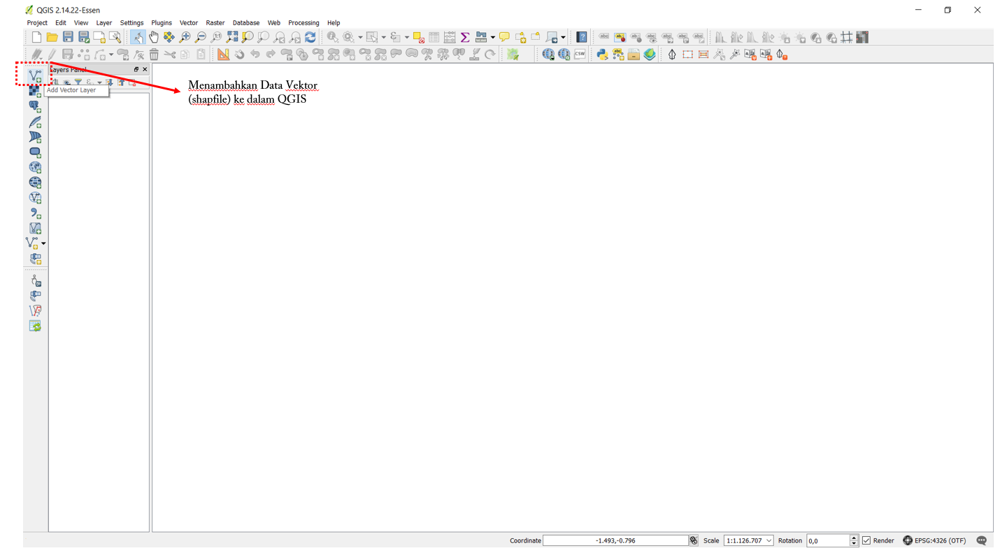

<i>Menambahkan data shapefile ke dalam QGIS</i>

*   Kemudian cari dan masukan data _shapefile_ yang ingin Anda konversi ke dalam bentuk  _GeoJSON_ di QGIS dengan klik **_Browse_** dan klik **_Open_**

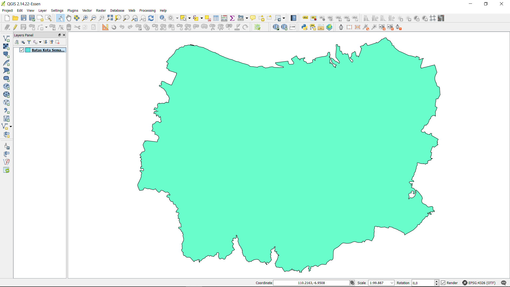

<i>Tampilan data shapefile di QGIS</i>

*   Klik kanan pada _layer _data _shapefile_ Anda kemudian pilih **_Save As..._**

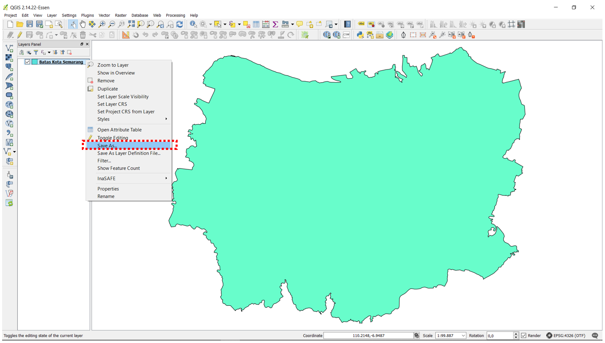

<i>Pilihan untuk konversi data shapefile</i>

*   Anda akan melihat sebuah kotak dan aturlah seperti gambar di bawah ini:

  

<i>Tampilan pengaturan konversi shapefile ke GeoJSON</i>

*   **_Format_** : Pilihlah Format **_GeoJSON_**
*   **_Save as_** : Tempat/Direktori Anda menyimpan data _GeoJSON_
*   **_CRS_** : Referensi Koordinat untuk hasil data _GeoJSON_
*   **_Add saved file to map_** : Memasukkan data _GeoJSON_ ke dalam QGIS setelah proses konversi selesai
*   Jika sudah, maka klik **OK** dan Anda sudah berhasil melakukan konversi data GeoJSON yang akan muncul di QGIS komputer/laptop Anda.

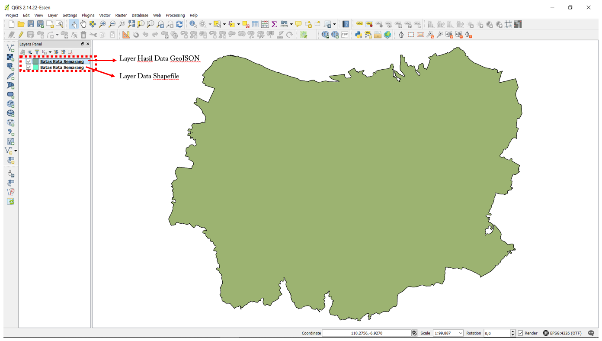

<i>Tampilan hasil konversi GeoJSON di QGIS</i>

### **III. Mendapatkan Data GeoJSON dengan _Overpass Turbo_**

Jika Anda tidak ingin atau tidak bisa menginstal QGIS di laptop/komputer Anda akan tetapi ingin melakukan konversi format data ke GeoJSON dari data _OpenStreetMap_ maka _Overpass Turbo_ adalah solusi untuk hal tersebut. _Overpass Turbo_ adalah suatu situs yang diciptakan oleh kontributor _OpenStreetMap_ dimana dapat memudahkan para pengguna mendapatkan beberapa format data spasial dari _OpenStreetMap_ dan GeoJSON adalah salah satunya. Silakan ikuti langkah-langkah berikut untuk mendapatkan GeoJSON dari situs _Overpass Turbo_ :

*   Silakan buka **_browser_** internet Anda kemudian buka situs [https://overpass-turbo.eu/](https://overpass-turbo.eu/) 

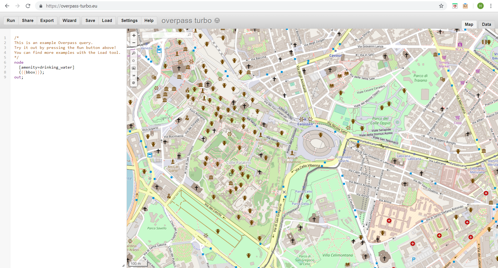

<i>Tampilan awal situs Overpass Turbo</i>

*   Setelah itu silakan cari area yang ingin Anda ambil datanya di _OpenStreetMap _dengan mengetikan nama area di kotak pencarian atau bisa juga dengan mengatur tampilan peta dengan memperbesar dan memperkecil peta dengan simbol ‘**+**' dan ‘**-**’

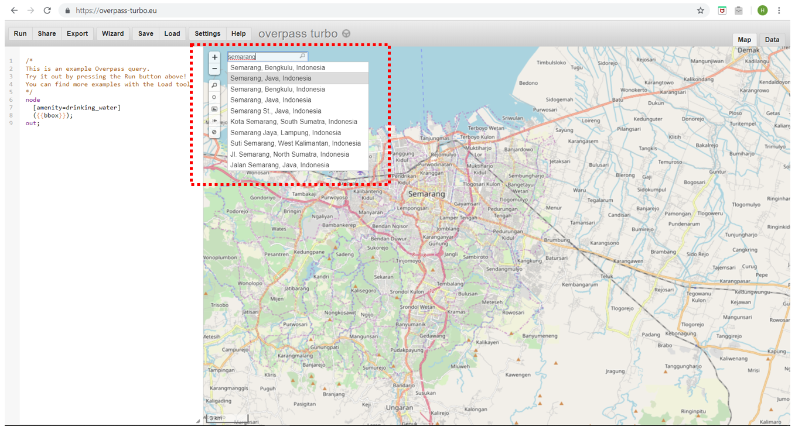

<i>Pencarian area di situs Overpass Turbo</i>

*   Setelah menemukan area di _OpenStreetMap_ yang ingin Anda ambil datanya sebagai GeoJSON, selanjutnya silakan pilih menu **_Wizard_** di sebelah atas dari situs _Overpass Turbo_.

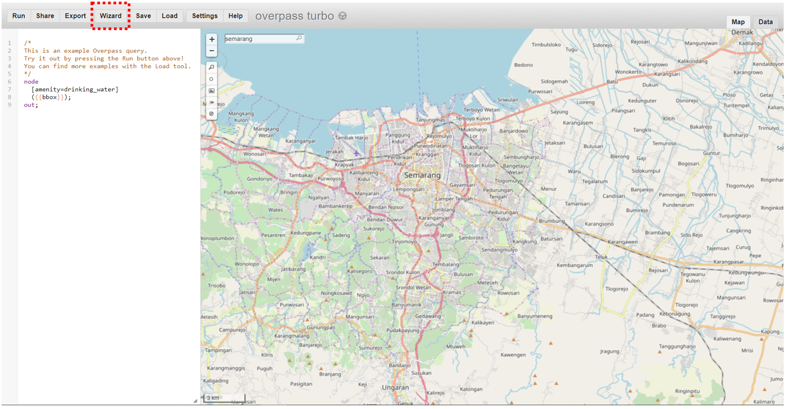

<i>Menu wizard di situs Overpass Turbo</i>

*   Setelah itu masukkan **_query_** terhadap data yang ingin Anda dapatkan. _Query_ yang Anda masukkan merupakan _tag_ yang memiliki _key_ dan _value_ berdasarkan standar _OpenStreetMap_. Jika Anda belum mengetahui tentang _tag_ serta _key_ dan _value_ maka Anda dapat melihat Modul **Model Data _OpenStreetMap_** terlebih dahulu. Sebagai contoh _query_ di modul ini, Anda ingin mengambil batas administrasi Kota Semarang oleh karena itu Anda dapat menuliskan “**_admin_level=5 and name=Semarang”_** di _query wizard_ dan klik **_build and run query_**

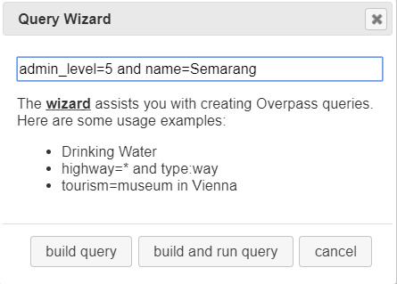

<i>Tampilan query wizard di situs Overpass Turbo</i>

*   Setelah itu hasil _query_ akan muncul di _Overpass Turbo_

  

<i>Tampilan hasil query wizard batas Kota Semarang</i>

*   Setelah hasil _query_ muncul silakan klik **_Export_** di menu _Overpass Turbo_ kemudian pilih dan klik pilihan **_download/copy as GeoJSON._**

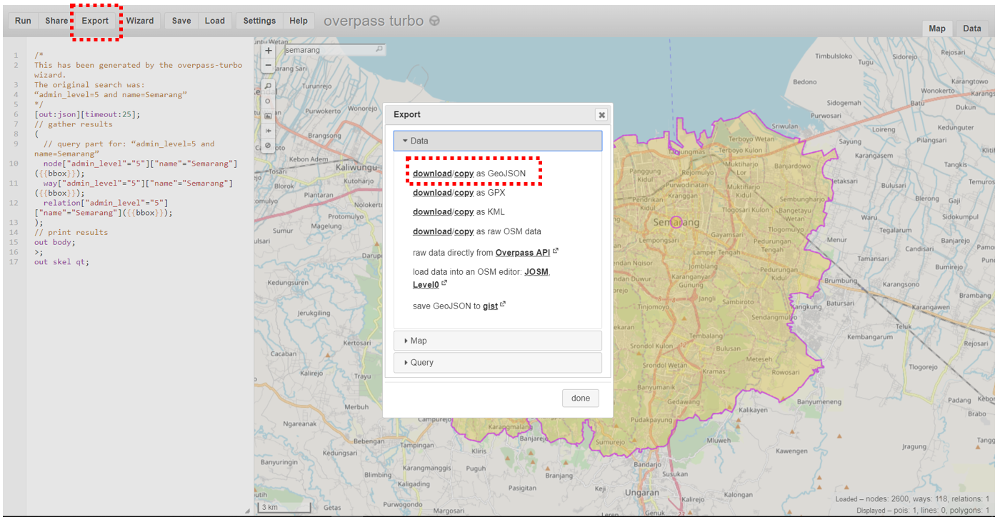

<i>Pilihan export format data GeoJSON di Overpass Turbo</i>

### **IV. Konversi _Shapefile_ ke GeoJSON dengan _GeoData Converter_**

Jika Anda ingin mengubah data _shapefile_ Anda sendiri bukan dari _OpenStreetMap_ kemudian tidak ingin atau tidak bisa menginstal QGIS di laptop/komputer, maka Anda dapat menggunakan salah satu situs di internet yang menyediakan fungsi melakukan konversi data _shapefile_ ke GeoJSON seperti _GeoData Converter_. Untuk melakukan konversi di situs ini silakan ikuti langkah-langkah berikut:

*   Silakan buka **_browser_** internet Anda kemudian buka situs [https://mygeodata.cloud/converter/shp-to-geojson](https://mygeodata.cloud/converter/shp-to-geojson) 

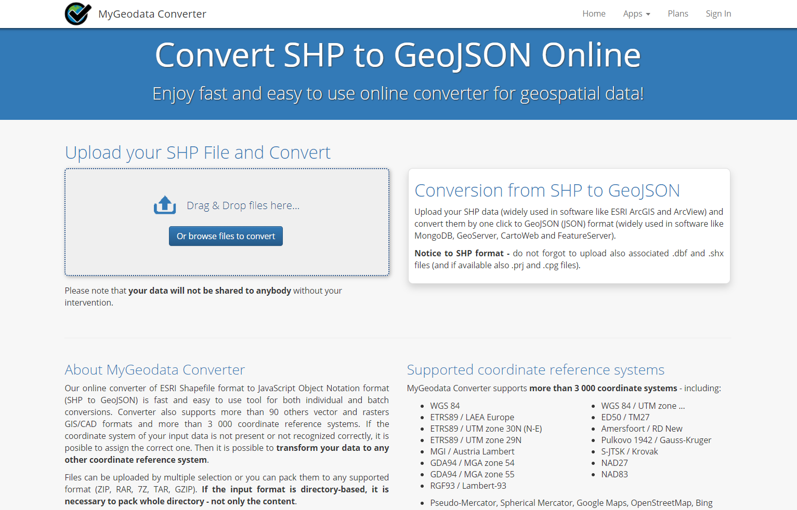

<i>Tampilan situs MyGeoData Converter</i>

*   Masukkan data _shapefile_ Anda di kotak _Upload_ dengan klik kalimat **_Or browse file to convert_** kemudian pilih **+** **Add Files..**

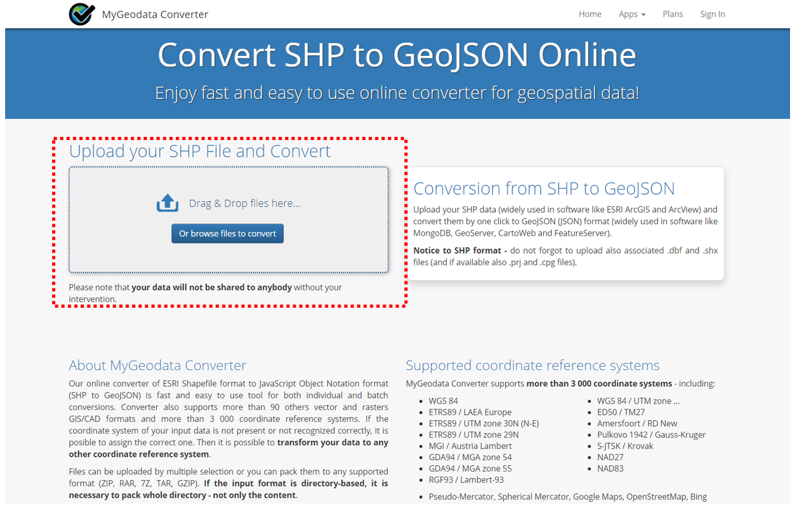

<i>Kotak untuk memasukkan Data Shapefile</i>

*   Perlu Anda ketahui saat mengunggah data _shapefile_ jangan lupa ikut menyertakan _file_ yang terasosiasi dengan _shapefile_ seperti _.dbf_ dan _.shx_ agar data _shapefile_ Anda dapat dikonversi dengan sempurna. Jadi,  pastikan Anda sudah memilih semua _file_ seperti contoh di bawah ini:

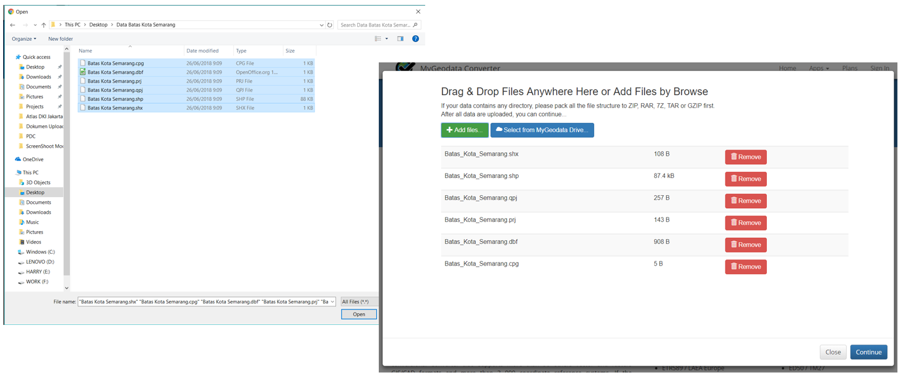

<i>Hasil memasukkan data shapefile ke situs GeoData Converter</i>

*   Kemudian klik **_Continue_** dan Anda akan melihat kotak konfirmasi untuk data _shapefile_ yang ingin Anda konversi. Pastikan **_Output Format_** sudah _GeoJSON_ kemudian klik **_Convert Now!_**

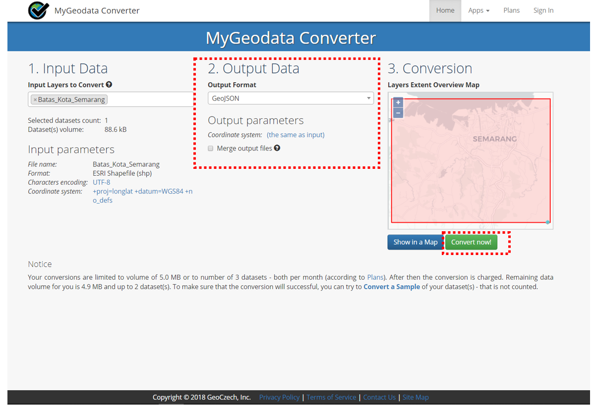

<i>Jendela ringkasan sebelum memulai konversi</i>

*   Jika sudah silakan klik **_Download_** pada jendela yang muncul. Data GeoJSON hasil konversi akan otomatis diunduh ke dalam laptop/komputer Anda.

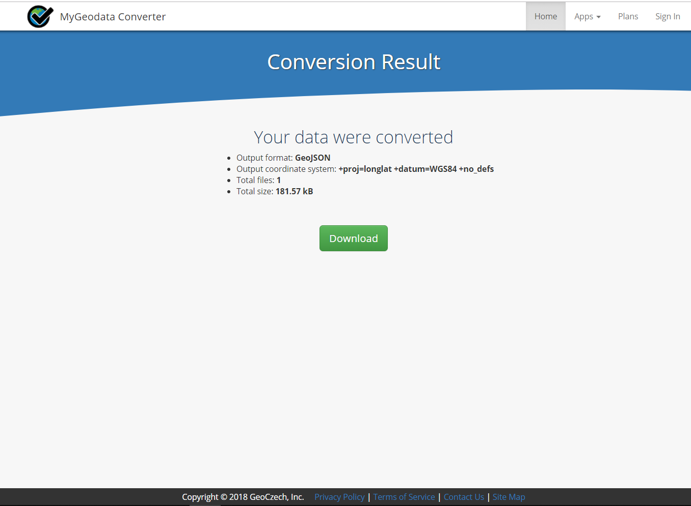

<i>Jendela untuk mengunduh hasil konversi GeoJSON</i>

**RINGKASAN**

Anda telah mempelajari tentang data spasial dengan format GeoJSON dan juga bagaimana melakukan konversi data _shapefile_ ke GeoJSON dengan menggunakan beberapa alat seperti QGIS, _Overpass Turbo,_ dan _GeoData Converter_. Seluruh alat bantu tersebut dapat Anda gunakan sesuai dengan kebutuhan dan ketersediaan data _shapefile_ yang Anda miliki. Data GeoJSON yang Anda miliki dapat digunakan sebagai tampilan di _WebGIS_ atau situs-situs yang dapat menampilkan data spasial seperti _Mapbox, Leaflet, HOT Export_ dan _Tasking Manager_.
